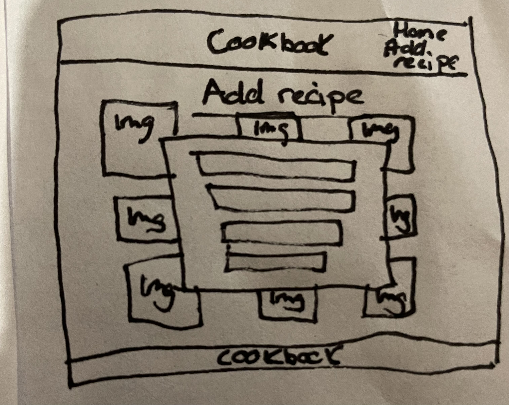
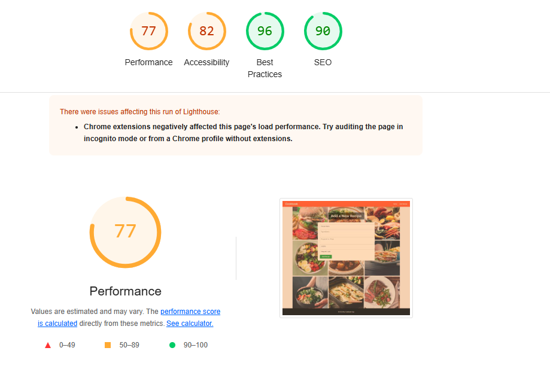

# 🍲 Cookbook – Recipe Management App

This web app is designed to let users store, view, edit, and delete cooking recipes in a simple, user-friendly way. It was built using Flask (Python) on the back end and custom HTML/CSS on the front end.

The goal was to create something that’s easy to use, clean-looking, and focused on functionality — while also showing what I’ve learned during the course.

## 📌 Project Purpose

I built this app as part of my Code Institute portfolio projects. The idea was to create something that could be useful to everyday users — home cooks, meal preppers, or anyone looking to collect recipes in one place.

It also helps simulate a small business or brand, since the site could be used to promote a range of cooking tools and equipment.

I wanted to keep the design light, readable, and distraction-free, while still looking good visually — hence the background image grid and color scheme.

## 👥 Target Audience

- People who want to collect or share recipes
- Anyone looking for inspiration for what to cook
- People who prefer a private, simple recipe tracker
- Users who might also be browsing kitchen tools or cooking gear

## 🔧 Features

- Full CRUD: Add, edit, delete, and view recipes
- Recipes include ingredients, preparation steps, cuisine type, and required tools
- Fully responsive layout with flexbox and grid
- Soft image grid background using real meal photos
- Clear call-to-action buttons
- Form validation (HTML-level)
- Footer always sticks to bottom
- PostgreSQL database integration for data persistence
- Works on mobile, tablet, and desktop

## 🛠️ Technologies Used

- Python & Flask – Backend framework
- PostgreSQL – Remote relational database hosted via [dbs.ci-dbs.net](https://dbs.ci-dbs.net/)
- Flask-SQLAlchemy – ORM for database operations
- Gunicorn – WSGI server for production deployment
- psycopg2-binary – PostgreSQL database adapter
- HTML5 – Markup and structure
- CSS3 – Custom styling and responsive layout
- Google Fonts – 'Inter' font used site-wide
- Git / GitHub / Gitpod – Version control and cloud IDE
- Render.com – Hosting and deployment platform
- Pexels – Source for meal background images
- W3C Validators – To validate HTML and CSS

## 🧪 Testing Summary

Most of the testing was done manually during development and after feature implementation.

### Tested:
- Adding and editing multiple recipes
- Deleting recipes and ensuring layout adjusts
- Empty form submissions blocked (HTML required fields)
- Footer stays pinned to bottom of screen
- Mobile navigation and responsiveness
- Background readability over image grid
- Database persists recipes across sessions

### Validation:
- HTML validated using W3C Markup Validator
- CSS validated using W3C CSS Validator

## 💡 UX / Wireframe Planning

Due to technical issues with Balsamiq (crashing repeatedly), I instead planned the layout through iterative development and sketching.

The final layout was built with user-first design in mind:

- Simple navigation
- Easy-to-use forms
- Readable text over background
- Footer that stays visible

Below are wireframe sketches:




## ⚡ Lighthouse Test

I ran Lighthouse in Chrome DevTools to check performance and accessibility. Lighthouse was run locally. Some performance impact may have been caused by browser extensions.

| Area | Score |
|:---|:---|
| Performance | 77 |
| Accessibility | 82 |
| Best Practices | 96 |
| SEO | 90 |

### Changes I made to improve these:

- Resized and compressed images
- Added `preconnect` to Google Fonts
- Removed unused styles and cleaned up layout spacing
- Ensured color contrast and alt text for accessibility



## 🚀 Deployment

This project was deployed using **Render**.

Here's how the deployment was done:

- I created a `requirements.txt` file by running:

```bash
pip freeze > requirements.txt

I added a Procfile with the line:

bash
Copy
web: gunicorn app:app
A PostgreSQL database was set up through Code Institute's dbs.ci-dbs.net, and the database URL was stored securely on Render as an environment variable called DATABASE_URL.

Build command used on Render:

bash
Copy
pip install -r requirements.txt
Start command used:

bash
Copy
gunicorn app:app
Connected my GitHub repo to Render and deployed from the main branch.

Live Site:
👉 https://online-cookbook-gxgd.onrender.com

📦 Git & Version Control
Git was used for tracking changes and version history.

All commits were made with clear messages during development.

Project is hosted on GitHub.

🧾 Attribution
Google Fonts – For the 'Inter' font used across the site

Pexels – For the meal background images

General layout inspiration – CSS Grid and Flexbox layout tutorials

Flask and SQLAlchemy setup – Based on Code Institute materials and Flask official documentation

Render – Hosting platform for deployment

Neon (dbs.ci-dbs.net) – PostgreSQL database hosting

All code was written manually unless otherwise credited.

📷 Background Image Grid
I used a CSS Grid layout to create the background image grid.

The idea was inspired by:

W3Schools: How To Create an Image Grid

MDN Web Docs: CSS Grid Layout

All images were sourced from Pexels.

👤 Personal Note & AI Tools Disclaimer
This project was built entirely by me.
The only help I had was from Code Institute’s course materials and some layout tutorials (credited above).

I used ChatGPT a few times — but only to explain layout ideas and fix some spacing or responsiveness issues. All code was manually written by me after understanding the solutions.

Due to personal circumstances during the course, I was often learning new concepts while building the project at the same time.
It made the process challenging but also really helped me learn faster.
I'm really happy with how the project turned out overall.

🌟 Future Features
If I return to this project, I'd like to add:

Search Bar – To let users search for recipes by name or type

User Accounts – So people could save their own private recipe collections

Recipe Categories – Group recipes like "Vegetarian", "Quick Meals", etc

Image Uploads – Let users upload a photo of their finished dish

Ratings or Likes – Allow users to mark favorite recipes

Dark Mode – Add an option to toggle between light and dark themes

These features would make the app even more useful and community-driven.